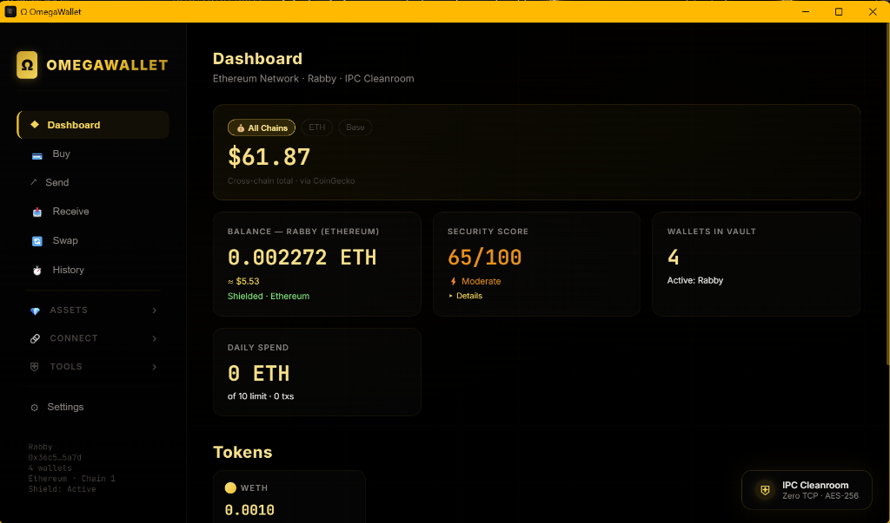
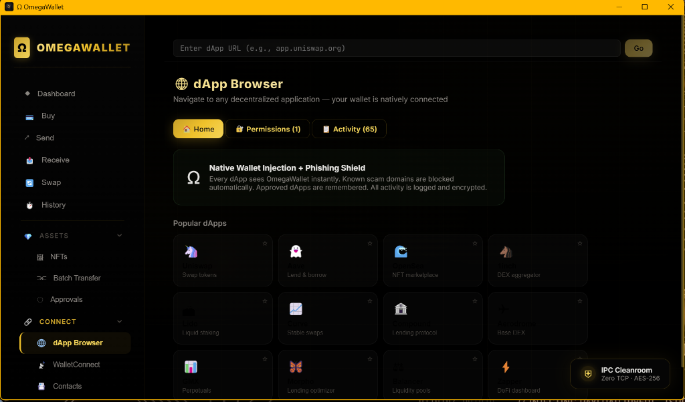
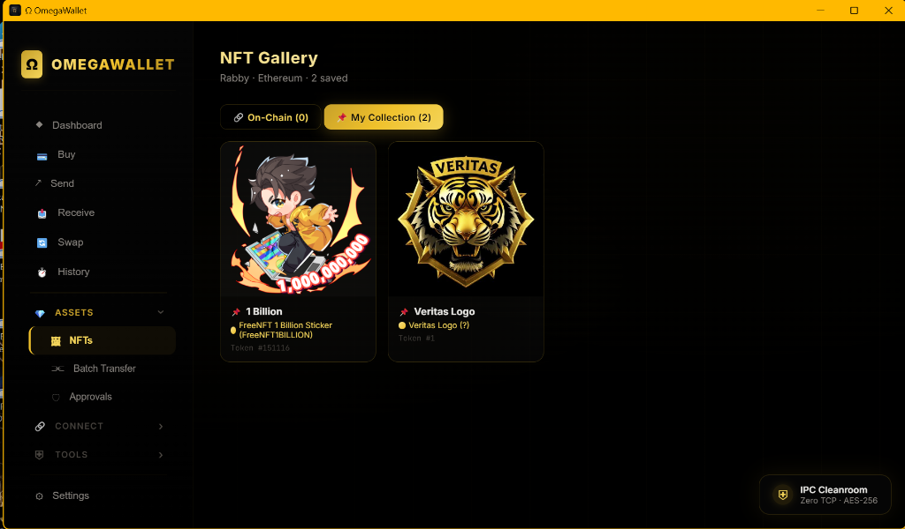
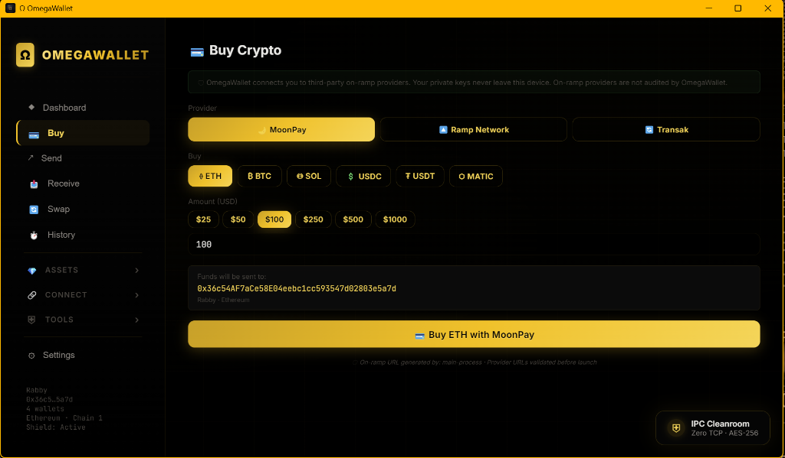
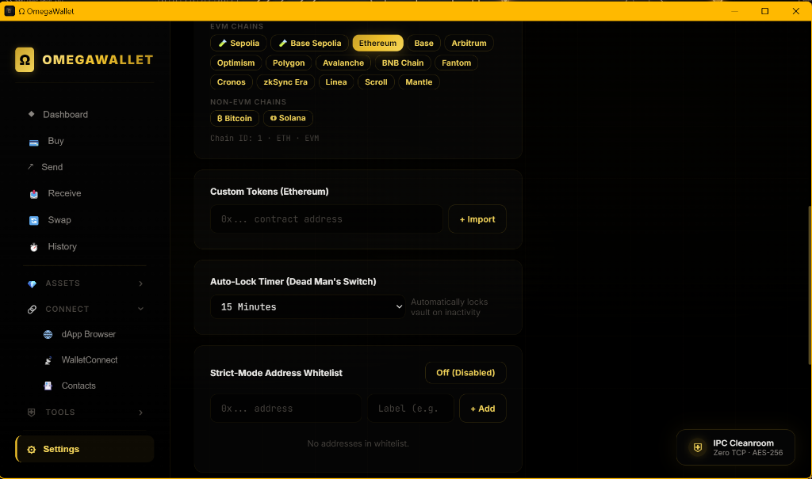

<div align="center">
  
  <h1>OMEGA WALLET</h1>
  <p><strong>Renderer-Cannot-Sign Desktop Ethereum Wallet — VERITAS &amp; Sovereign Ecosystem</strong></p>
</div>


---

<div align="center">
  
  <br/>
  <sup><em>Security-First Dashboard &mdash; VERITAS gold-and-obsidian aesthetic</em></sup>
</div>
<br/>

## Ecosystem Canon

OmegaWallet is the sovereign key-custody and transaction-execution layer of the **VERITAS Omega Universe** — a deterministic, operator-grade stack built for operators who will not compromise on trust boundaries. The wallet enforces a single, non-negotiable invariant: **the renderer process cannot sign**; all cryptographic operations are confined to the Electron main process, separated from the React UI by a validated, schema-enforced IPC bridge.

OmegaWallet ships alongside Cerberus (real-time contract risk analysis), a backend ERC-4337 bundler proxy, and a suite of Solidity smart-account modules designed for programmable, policy-bounded on-chain execution. As a node in the Omega Universe, it interoperates with `omega-brain-mcp`, `veritas-vault`, `Ollama-Omega`, `Aegis`, and `SovereignMedia` under a unified security posture inherited from the VERITAS Framework.

---

## Overview

**What it is:**

- A production-grade Electron desktop wallet for Ethereum and EVM-compatible chains.
- An ERC-4337 smart account platform with modular on-chain policy enforcement.
- A browser extension providing EIP-1193 provider injection for dApp interaction.
- An internal adversarial-tested application (141 scenarios, 15 campaigns — see [SECURITY_VALIDATION.md](./SECURITY_VALIDATION.md)).

**What it is not:**

- Externally audited. See [KNOWN_LIMITATIONS.md](./KNOWN_LIMITATIONS.md) for the full scope of what internal testing does not cover.
- A custodial or cloud-connected service. Zero keys leave the local machine.
- A finished, stable v1.0 release. Current status: **5.0.0-rc1 / feature-frozen pre-release**.

---

## Components

| Component | Location | Role |
|---|---|---|
| Electron App | `electron/` | Main process: key vault, signing, IPC handlers, FreshAuth, Cerberus scanner |
| React Frontend | `frontend/` | Renderer UI (Vite + React 19): balances, TX builder, token management — no key access |
| Browser Extension | `extension/` | EIP-1193 provider injection, background service worker, popup UI |
| Backend API | `backend/` | Express.js: ERC-4337 bundler proxy, RPC proxy, transaction simulator, Tor/Nym routing |
| Smart Contracts | `src/` | Solidity 0.8.28 (Foundry): OmegaAccount (ERC-4337), modules, deploy scripts |
| Deploy Scripts | `script/` | Foundry deployment and verification scripts |

<br/>

<div align="center">
  
  <br/>
  <sup><em>Native dApp Browser with Phishing Shield &mdash; VERITAS gold-and-obsidian aesthetic</em></sup>
</div>
<br/>

<div align="center">
  
  <br/>
  <sup><em>ERC-721/1155 NFT Asset Gallery &mdash; VERITAS gold-and-obsidian aesthetic</em></sup>
</div>
<br/>

<div align="center">
  
  <br/>
  <sup><em>On-Ramp Provider Integration &mdash; VERITAS gold-and-obsidian aesthetic</em></sup>
</div>
<br/>

<div align="center">
  
  <br/>
  <sup><em>Security Settings & Policy Guard &mdash; VERITAS gold-and-obsidian aesthetic</em></sup>
</div>
<br/>

---

## Architecture

```
+============================================================+
|                    OMEGA WALLET SYSTEM                     |
+============================+===============================+
|   ELECTRON APPLICATION     |    BROWSER EXTENSION          |
|                            |                               |
|  +---------------------+   |  +-------------------------+  |
|  |  frontend/          |   |  |  extension/             |  |
|  |  React UI (Vite)    |   |  |  popup.js               |  |
|  |  No key access      |   |  |  background.js          |  |
|  |  No RPC access      |   |  |  provider.js (EIP-1193) |  |
|  +----------+----------+   |  +-------------------------+  |
|             |              |                               |
|        IPC Bridge          |                               |
|    (schema-validated)      |                               |
|             |              |                               |
|  +----------v----------+   |                               |
|  |  electron/          |   |                               |
|  |  main.js            |   |                               |
|  |  ipc-handlers.js    |   |                               |
|  |  AES-256-GCM vault  |   |                               |
|  |  FreshAuth tokens   |   |                               |
|  |  Signing engine     |   |                               |
|  |  Cerberus scanner   |   |                               |
|  +----------+----------+   |                               |
+============+=+=============+===============================+
             |   HTTP (localhost only)
  +----------v------------------------------------------+
  |  backend/                                           |
  |  ERC-4337 bundler proxy  |  Cerberus risk scanner   |
  |  RPC proxy (multi-chain) |  Transaction simulator   |
  |  Tor / Nym routing       |  WebAuthn endpoint       |
  +-----------------------------------------------------+

+============================================================+
|  SMART CONTRACTS  (src/ + script/ — Foundry 0.8.28)       |
|                                                            |
|  OmegaAccount (ERC-4337)    OmegaAccountFactory           |
|  SessionKeyModule           SocialRecoveryModule           |
|  BatchExecutorModule        IntentModule                   |
|  DuressModule               SpendLimitHook                 |
|  OmegaPaymaster             StealthAddressModule           |
+============================================================+
```

---

## Quickstart

### Prerequisites

- Node.js >= 20
- npm >= 10
- (Optional) [Foundry](https://book.getfoundry.sh/getting-started/installation) for smart contract work

### 1. Root (Electron App)

```bash
# Install root dependencies (Electron shell)
npm install

# Start the desktop application (requires frontend build or running dev server)
npm start
```

### 2. Frontend (React UI)

```bash
cd frontend
npm install
npm run dev        # Vite dev server on http://localhost:5173
npm run build      # Production build -> frontend/dist/
```

### 3. Backend API

```bash
cd backend
npm install
cp .env.example .env   # Edit with your RPC endpoints and bundler keys
npm run dev            # Node --watch dev mode on port 3001
npm start              # Production mode
```

### 4. Electron — Production Build

```bash
cd electron
npm install
npm run build          # Portable .exe (Windows)
npm run build:nsis     # NSIS installer (Windows)
```

### 5. Smart Contracts (Foundry)

```bash
# From repo root
forge install          # Install submodule dependencies
forge build            # Compile all contracts
forge test             # Run unit + fuzz tests
```

---

## Configuration

The backend reads environment variables from `backend/.env` (not committed). Copy the provided example and fill in your values:

```bash
cp backend/.env.example backend/.env
```

| Variable | Default | Description |
|---|---|---|
| `PORT` | `3001` | Backend HTTP port |
| `LOG_LEVEL` | `info` | Winston log level (`debug`, `info`, `warn`, `error`) |
| `CORS_ORIGIN` | `http://localhost:5173` | Allowed CORS origin (renderer or extension) |
| `RPC_ETH` | `https://eth.llamarpc.com` | Ethereum mainnet RPC endpoint |
| `RPC_BASE` | `https://mainnet.base.org` | Base mainnet RPC endpoint |
| `RPC_ARB` | `https://arb1.arbitrum.io/rpc` | Arbitrum One RPC endpoint |
| `RPC_OP` | `https://mainnet.optimism.io` | Optimism mainnet RPC endpoint |
| `BUNDLER_RPC_ETH` | _(empty)_ | ERC-4337 bundler URL for Ethereum (Stackup / Pimlico / Alchemy) |
| `BUNDLER_RPC_BASE` | _(empty)_ | ERC-4337 bundler URL for Base |
| `BUNDLER_RPC_ARB` | _(empty)_ | ERC-4337 bundler URL for Arbitrum |
| `BUNDLER_RPC_OP` | _(empty)_ | ERC-4337 bundler URL for Optimism |
| `TOR_SOCKS_HOST` | _(empty)_ | SOCKS5 host for Tor routing (leave blank to disable) |
| `TOR_SOCKS_PORT` | `9050` | SOCKS5 port for Tor |
| `NYM_GATEWAY` | _(empty)_ | Nym mixnet gateway (alternative to Tor) |

> **Security note**: Never commit `backend/.env`. The `.gitignore` excludes it. Bundler RPC keys with signing authority should be treated as secrets and rotated if exposed.

---

## Security

OmegaWallet's security posture is documented across three files:

| Document | Contents |
|---|---|
| [SECURITY.md](./SECURITY.md) | Vulnerability reporting policy, architecture summary, validation status, supported versions |
| [SECURITY_AUDIT.md](./SECURITY_AUDIT.md) | Pre-audit checklist: smart contracts, access control, reentrancy, integer safety, backend hardening |
| [SECURITY_VALIDATION.md](./SECURITY_VALIDATION.md) | Internal adversarial validation milestone report (Phase II — PASSED) |

**Key security properties:**

- The renderer process has zero access to private keys, seed phrases, vault file, or RPC URLs.
- All IPC channels are whitelisted and schema-validated before execution.
- FreshAuth tokens are single-use, time-limited, and rate-limited for destructive operations.
- Two-phase signing (`bundler:prepare` -> `bundler:confirm`) with crypto-random `prepareId`.
- AES-256-GCM encrypted vault with per-vault salt, IV, and auth-tag integrity.
- Spend limits enforced at prepare time; configurable daily caps per wallet.

---

## Threat Model

This is a minimal, realistic threat model for a local desktop wallet. It does not cover threats not addressed by the current implementation.

| Threat | Boundary | Mitigation |
|---|---|---|
| Compromised renderer process | IPC Bridge | Renderer has no key access; all IPC messages schema-validated |
| Malicious dApp requesting signing | FreshAuth gate | Two-phase signing requires explicit user confirmation with time-limited token |
| Vault file exfiltration | Disk encryption | AES-256-GCM; decryption requires user password (PBKDF2-derived key) |
| RPC endpoint manipulation | Main process proxy | RPC URLs never exposed to renderer; proxy validates host whitelist |
| Malicious smart contract interaction | Cerberus scanner | Bytecode analysis and risk scoring before any signing |
| Session key abuse | On-chain policy | Session keys triple-bounded: time window, spend limit, scope |
| Social recovery attack | Timelock | Social recovery requires guardian threshold AND mandatory timelock delay |

**Out of scope for current release:**

- Hardware wallet integration (YubiKey / Ledger) — planned, not implemented.
- Network-level MITM on RPC connections — no TLS certificate pinning.
- Multi-device vault sync — vault is local-only; no cloud backup.
- Long-runtime burn testing — the current test suite completes in under 15 seconds and does not include extended stress scenarios (24–48h runtime validation).

See [KNOWN_LIMITATIONS.md](./KNOWN_LIMITATIONS.md) for the complete list.

---

## Known Limitations

See [KNOWN_LIMITATIONS.md](./KNOWN_LIMITATIONS.md) for the full, maintained list of unvalidated areas, test harness gaps, and features not yet implemented.

---

## Roadmap

The following capabilities are planned or in progress. No delivery dates are committed.

- Hardware wallet integration: YubiKey 5 NFC FIPS, Ledger hardware signing
- WalletConnect dApp bridge testing and validation
- External security audit by an independent firm
- Slither and Mythril static analysis on smart contracts (see [SECURITY_AUDIT.md](./SECURITY_AUDIT.md))
- Halmos symbolic execution on critical contract paths
- Multi-sig contract deployment pipeline
- Rate limiting and input validation on all backend routes
- WCAG accessibility audit and keyboard-only navigation
- Extended burn testing (24-48h runtime validation)

---

## Omega Universe

OmegaWallet is one node in the **VERITAS & Sovereign Ecosystem**. Related repositories:

| Repository | Role |
|---|---|
| [omega-brain-mcp](https://github.com/VrtxOmega/omega-brain-mcp) | Model Context Protocol orchestration layer |
| [veritas-vault](https://github.com/VrtxOmega/veritas-vault) | Encrypted operator knowledge vault |
| [Ollama-Omega](https://github.com/VrtxOmega/Ollama-Omega) | Local LLM runtime integration |
| [Aegis](https://github.com/VrtxOmega/Aegis) | Operator security and privacy layer |
| [drift](https://github.com/VrtxOmega/drift) | Ecosystem drift detection and alignment tooling |
| [SovereignMedia](https://github.com/VrtxOmega/SovereignMedia) | Sovereign media and content pipeline |
| [sovereign-arcade](https://github.com/VrtxOmega/sovereign-arcade) | VERITAS Omega — Sovereign Arcade suite |

---

## Contributing

See [CONTRIBUTING.md](./CONTRIBUTING.md) for contribution guidelines, branch conventions, and code standards.

---

## License

MIT — see [LICENSE](./LICENSE) if present, or refer to the badge above.

---

<div align="center">
  <sub>Built by <a href="https://github.com/VrtxOmega">RJ Lopez</a> &nbsp;|&nbsp; VERITAS Framework &nbsp;|&nbsp; Omega Universe</sub>
</div>
